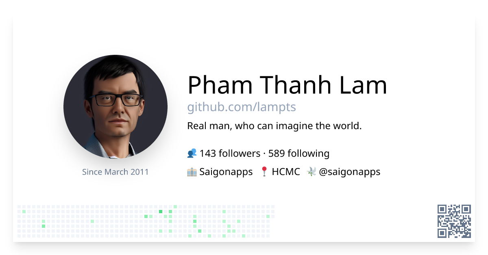

<pre style="font-family:Menlo,'DejaVu Sans Mono',consolas,'Courier New',monospace">🙂 <a href="https://aifirst.ml">PHAM Thanh Lam</a>
┣â”┠📦 Open Source Packages
┃   ┣━━ <a href="https://apps.apple.com/us/app/notebook-master-for-jupyter/id1326802832">notebook master</a>       - jupyter notebook reader
┃   ┗━━ <a href="https://github.com/lampts/bert4vn">bert4vn</a>    -  Bert for vietnamese
┣â”┠🥇 Competitions
┃   ┣━━ <a href="https://github.com/nutiapps/aicovidvn115m">aicovidvn115m</a>         - AICovid115m, 2nd place of cough classification, AICOVID115M cup 
┃   ┃   2021, Vietnam
┃   ┣━━ <a href="https://github.com/lampts/wsdm19cup">wsdm19cup</a>         - Bytedance, 1st place of fake news detection, WSDM cup 2019, Australia
┃   ┗━━ <a href="https://github.com/lampts/cikm17_cup_lazada_product_title">cikm17cup</a>           - Lazada, 8th place of product title quality classification, CIKM 2017, 
┃       Singapore
┣â”┠👠Contributions
┃   ┣━━ <a href="https://github.com/ngoanpv/albert_vi">albert_vi</a>      - guidance and contributed to build albert for vietnamese in 2019
┃   ┗━━ <a href="https://github.com/lampts/vietai">vietai lectures</a>      - contributed the free and open lectures in 2017
┗━━ 🎙️ Popular Talks
    ┣━━ <a href="https://topdev.vn/page/thuat-toan-va-te-bao-goc-cua-ai-big-data">Productionize AI system, TopDev 2019</a>
    ┣━━ <a href="https://www.vietnamworks.com/hrinsider/hon-1000-chuyen-vien-it-tham-du-tech-expo-2016-o-ha-noi.html">Vietnamworks Tech Expo, 2016</a>
    ┗━━ <a href="https://www.youtube.com/watch?v=4gagrwwMJcA">music2vec: A smart music recommendation and discovery, PyconSG 2016</a>

Follow me on twitter <a href="https://twitter.com/saigonapps">@saigonapps</a>
</pre>

